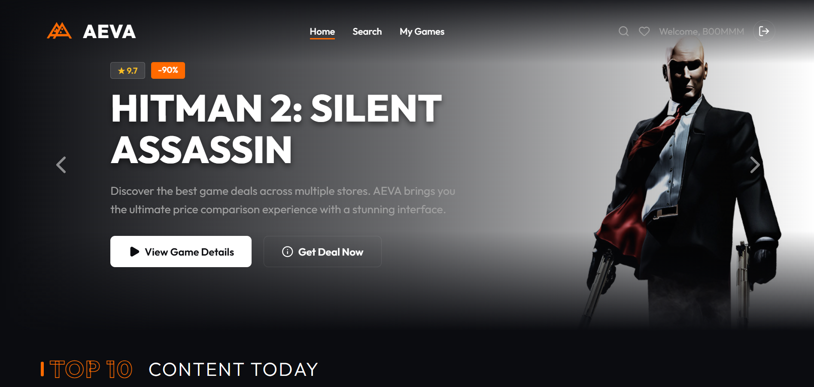
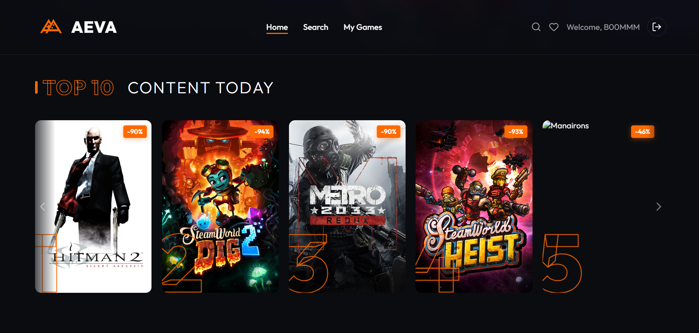
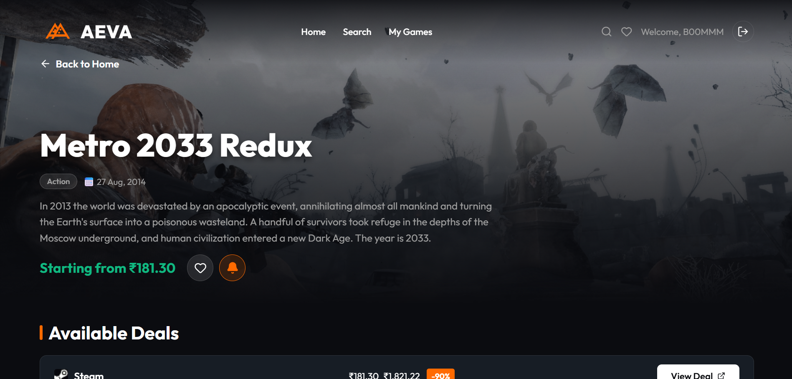
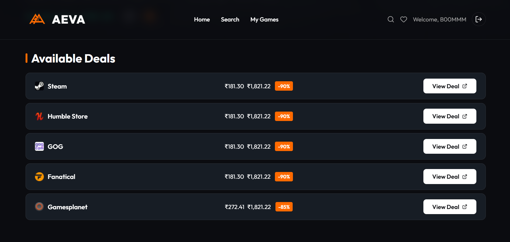
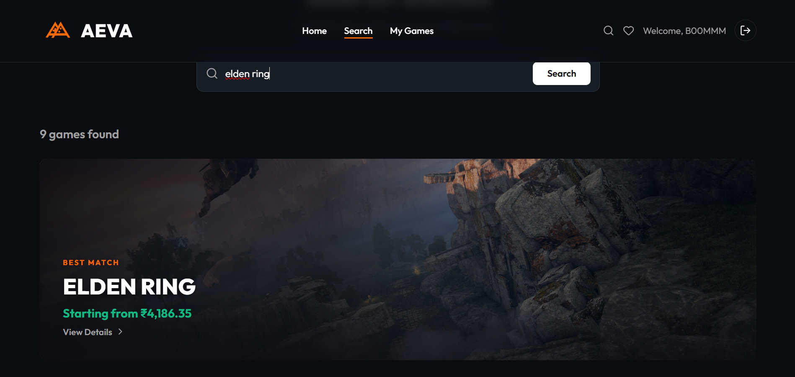
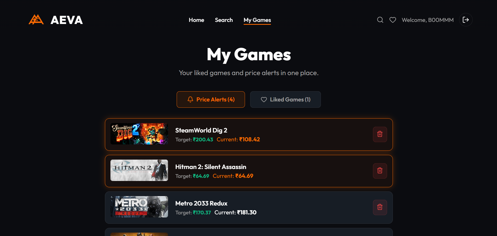
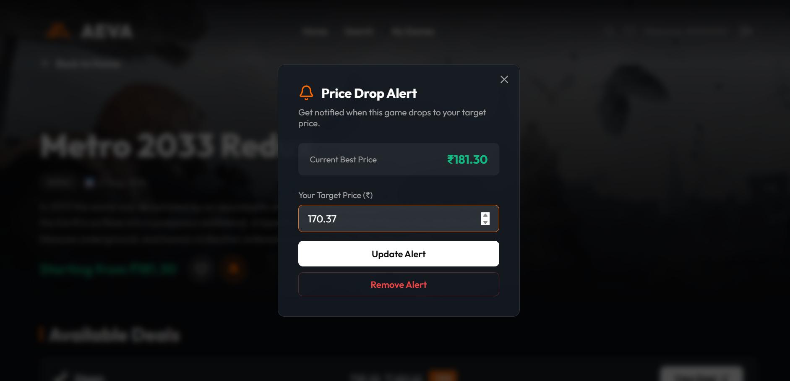

<p align="center">
  <h1 align="center">AEVA</h1>
  <p align="center">A game deal aggregator with a Netflix-inspired UI — track prices, set alerts, and discover the best deals across stores.</p>
</p>

---

## Screenshots

### Home Page



### Search


### Game Info & Deals



### Price Alerts



### Authentication


---

## Features

- **Trending Deals** — Auto-rotating hero section + horizontal scroll rows showing top deals
- **Game Search** — Search CheapShark's database with recent search history
- **Game Info** — Detailed page with screenshots, deals across stores, and metacritic scores
- **Price Alerts** — Set a target price and track when a game drops below it
- **Liked Games** — Save favorite games to a personal watchlist
- **Multi-Currency** — Auto-detects user region and converts prices (USD, EUR, GBP, etc.)
- **Auth System** — JWT-based register/login with protected routes
- **Dockerized** — One-command deployment with Docker Compose

---

## Tech Stack

### Frontend
| Technology | Purpose |
|---|---|
| **React 18** | UI library |
| **Vite 5** | Build tool & dev server |
| **React Router 7** | Client-side routing |
| **Axios** | HTTP client |
| **Lucide React** | Icon library |
| **Nginx** | Production static file server & reverse proxy |

### Backend
| Technology | Purpose |
|---|---|
| **Express 5** | REST API framework |
| **Mongoose 9** | MongoDB ODM |
| **MongoDB Atlas** | Cloud database (free M0 tier) |
| **Upstash Redis** | Caching & search history (free tier) |
| **JWT** | Authentication tokens |
| **bcryptjs** | Password hashing |
| **Morgan** | HTTP request logger |

### DevOps
| Technology | Purpose |
|---|---|
| **Docker** | Containerization |
| **Docker Compose** | Multi-container orchestration |
| **Nginx** | Reverse proxy (frontend → backend) |
| **GitHub Actions** | CI/CD auto-deploy to AWS |
| **AWS EC2** | Cloud hosting (free tier t2.micro) |

### External APIs
| API | Purpose |
|---|---|
| **CheapShark** | Game deals & pricing data |
| **Steam** | Game images & metadata |
| **ipapi.co** | Geo-location for currency detection |

---

## Project Structure

```
Aeva/
├── backend/
│   ├── Dockerfile
│   ├── server.js              # Express entry point
│   ├── config/redis.js        # Upstash Redis client
│   ├── middleware/auth.js     # JWT auth middleware
│   ├── models/
│   │   ├── User.js            # User schema (likes, alerts)
│   │   └── Cache.js           # Cache model
│   └── routes/
│       ├── auth.js            # Login / Register
│       ├── games.js           # Game search, trending, details
│       └── user.js            # Likes, alerts, search history
├── frontend/
│   ├── Dockerfile
│   ├── nginx.conf             # Production nginx config
│   ├── src/
│   │   ├── components/        # Navbar, GameCard, DealCard, Footer, PriceAlertModal
│   │   ├── context/           # AuthContext, CurrencyContext
│   │   └── pages/             # Home, Search, Info, Tracked, Login, Register
│   └── vite.config.js
├── docker-compose.yml
├── .github/workflows/deploy.yml
└── DOCKER_GUIDE.md
```

---

## Getting Started

### Prerequisites
- [Docker Desktop](https://www.docker.com/products/docker-desktop/) (recommended)
- OR [Node.js 20+](https://nodejs.org/) for local dev without Docker

### Run with Docker (recommended)

```bash
# Clone the repo
git clone https://github.com/YOUR_USERNAME/aeva.git
cd aeva

# Create backend env file
cp backend/.env.example backend/.env
# Fill in your MONGODB_URI, JWT_SECRET, UPSTASH_REDIS_REST_URL, UPSTASH_REDIS_REST_TOKEN

# Build and start
docker compose up --build

# Open http://localhost
```

### Run without Docker

```bash
# Backend
cd backend
npm install
node server.js

# Frontend (new terminal)
cd frontend
npm install
npm run dev

# Open http://localhost:3000
```

### Environment Variables

Create `backend/.env`:
```env
MONGODB_URI=mongodb+srv://<user>:<pass>@cluster.mongodb.net/aeva
JWT_SECRET=your_secret_key
UPSTASH_REDIS_REST_URL=https://your-redis.upstash.io
UPSTASH_REDIS_REST_TOKEN=your_redis_token
PORT=5000
```

---

## Deployment

See [DOCKER_GUIDE.md](DOCKER_GUIDE.md) for the full step-by-step guide to deploy on **AWS EC2 free tier** with automatic GitHub Actions CI/CD.

---

## License

MIT
